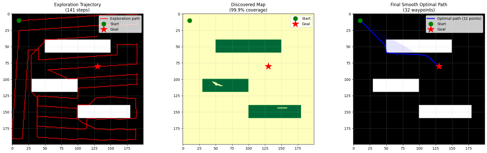

# Autonomous Hexapod Robot (ROS 2 Humble)

A six-legged walking robot with 18 servos, analytic inverse kinematics, LiDAR SLAM, A\* path planning and frontier exploration, controlled from a browser or a PS3 controller.

<!-- demo GIF here -->

## What it does

- Walks with a tripod gait (wave and ripple gaits also available). Each foot follows a Cartesian trajectory, and an analytic IK solver turns it into coxa/femur/tibia angles.
- Drives 18 Hiwonder HX-35HM bus servos from `/joint_states` through a USB-HID bridge with joint limits, rate limiting and a slow start-up ramp.
- Builds a 2D occupancy map and a 3D point cloud with RTAB-Map (360° LiDAR for pose, depth camera for 3D structure).
- Explores unknown rooms autonomously: nearest-frontier exploration, a coverage (lawnmower) mode, and A\* to a goal clicked in RViz.
- Remote control from a browser (Flask page + rosbridge), with manual/auto mode, a deadman timeout, body-posture sliders and emotes. A PS3 controller and a Tkinter GUI also work.

## Hardware

| Part | Used for |
|---|---|
| 3D-printed ABS chassis, 6 legs × 3 DOF | body |
| 18 × Hiwonder HX-35HM smart bus servos + Hiwonder bus-servo controller (USB HID) | joints |
| NVIDIA Jetson Nano | on-board ROS 2 (runs in Docker) |
| LDS-01 360° 2D LiDAR (`hls_lfcd_lds_driver`) | mapping and localisation |
| Orbbec Astra Pro depth camera | 3D point cloud and colour image |
| MPU-9250 IMU over I2C (optional) | tilt for self-balancing and fall detection |
| PS3 DualShock 3 (optional) | manual driving |
| Laptop on the same network | RViz, web UI, YOLOv8 detection |

## Software structure

The code is split into two colcon workspaces (kept separate so package names don't collide) plus a ROS-independent planning library.

| Path | Package | What it contains |
|---|---|---|
| `hexapod_ws/src/hexapod_control/` | `hexapod_control` | Gait controller, IK, servo bridge, IMU driver, Tkinter teleop |
| `hexapod_ws/src/hexapod_description/` | `hexapod_description` | URDF/xacro model, STL meshes, RViz config, launch files |
| `ros2_ws/src/hexapod_control/` | `hexapod_nav` | Mapping, planning, exploration, teleop multiplexers, Flask web UI |
| `ros2_ws/src/hexapod_gazebo/` | `hexapod_gazebo` | RTAB-Map, SLAM Toolbox, LiDAR and simulation launch files |
| `hexapod_path_planning_final/` | (plain Python) | A\*, Ramer–Douglas–Peucker smoothing, map inflation, frontier finder. No ROS imports |
| `scripts/` | | Start/stop scripts for the robot (tmux + Docker) |
| `laptop_viz/` | | Laptop side: RViz layout, YOLOv8 object detector |
| `docs/` | | Per-demo guides and architecture notes |

### Main nodes

| Node | Package | Role |
|---|---|---|
| `hexapod_controller` | hexapod_control | Gait + IK at a fixed rate; publishes `/joint_states` and `odom → base_link` |
| `hiwonder_servo_bridge` | hexapod_control | `/joint_states` → servo positions over USB HID |
| `imu_node` | hexapod_control | MPU-9250 → `/imu/data` (complementary filter) |
| `ui_teleop` | hexapod_nav | Web UI → robot multiplexer: manual/auto mode, deadman stop |
| `joy_teleop` | hexapod_nav | PS3 controller → robot commands |
| `lidar_explorer` | hexapod_nav | Frontier / coverage exploration and A\* to `/goal_pose` on the RTAB-Map grid |
| `lidar_mapper`, `lidar_path_planner` | hexapod_nav | Earlier home-made occupancy mapper and planner (before RTAB-Map) |
| `known_map_demo` | hexapod_nav | Simulation: random map → A\* → robot walks the path in RViz |
| `room_corners` | hexapod_nav | Reports the nearest room corner from given room dimensions |

### Main topics

| Topic | Type | Meaning |
|---|---|---|
| `/hexapod/cmd` | `std_msgs/String` | `walk`, `stop`, `forward`, `rotate_left`, gait and emote names … |
| `/hexapod/body_pose` | `geometry_msgs/Twist` | speed multiplier and steering yaw |
| `/hexapod/posture` | `geometry_msgs/Twist` | body roll/pitch/yaw and x/y/z offset |
| `/ui/cmd`, `/ui/body_pose`, `/ui/body_posture`, `/ui/mode` | | web UI → `ui_teleop` |
| `/joint_states` | `sensor_msgs/JointState` | 18 joint angles |
| `/scan` | `sensor_msgs/LaserScan` | LiDAR |
| `/rtabmap/map`, `/rtabmap/cloud_map` | `OccupancyGrid`, `PointCloud2` | 2D map and 3D cloud |
| `/goal_pose` → `/planned_path` | `PoseStamped` → `Path` | goal from RViz, planned A\* path |
| `/detections` | `std_msgs/String` (JSON) | YOLOv8 detections from the laptop |

### Launch files

| Launch file | Starts |
|---|---|
| `hexapod_description display.launch.py` | URDF + controller + RViz (simulation) |
| `hexapod_description display_headless.launch.py` | URDF + controller + IMU, no RViz (on the robot) |
| `hexapod_description hardware.launch.py` | URDF + controller + servo bridge |
| `hexapod_gazebo rtabmap.launch.py` | RTAB-Map (LiDAR ICP + depth cloud) |
| `hexapod_gazebo mapping.launch.py` | SLAM Toolbox 2D mapping |

## Build

Tested with ROS 2 Humble on Ubuntu 22.04. On the robot everything runs inside the Docker image from `hexapod.dockerfile` (it installs ROS packages, RTAB-Map, rosbridge, SciPy and Flask).

```bash
git clone https://github.com/MinaNan1/hexapod-ros2.git ~/hexapod-ros2
cd ~/hexapod-ros2

# Option A: Docker (what the robot uses). Mounts the repo at /hexapodd.
./start_ros.sh            # builds the image the first time, opens a shell
/hexapodd/build_ws.sh     # inside the container: builds both workspaces

# Option B: native ROS 2 Humble
source /opt/ros/humble/setup.bash
pip3 install numpy scipy matplotlib flask
cd hexapod_ws && colcon build && source install/setup.bash && cd ..
cd ros2_ws && colcon build --symlink-install && source install/local_setup.bash
```

Optional third-party packages go into `ros2_ws/src/`:
- Astra Pro camera: `bash scripts/setup_orbbec.sh` (clones OrbbecSDK_ROS2, `main` branch).
- rf2o laser odometry: `git clone https://github.com/MAPIRlab/rf2o_laser_odometry ros2_ws/src/rf2o_laser_odometry`.

## Run

**Simulation (no hardware): known map + A\***

```bash
# Terminal 1
source hexapod_ws/install/setup.bash
ros2 launch hexapod_description display.launch.py

# Terminal 2
source hexapod_ws/install/setup.bash && source ros2_ws/install/local_setup.bash
ros2 run hexapod_nav known_map_demo
```

In RViz set the fixed frame to `odom` and add `Map`, `Path`, `Marker (/walls_3d)` and `RobotModel`.

**Real robot (on the Jetson)**

```bash
sudo bash scripts/bringup_servos.sh     # once per boot: servo USB permissions + container
bash scripts/launch_all.sh              # robot, servos, camera, LiDAR, RTAB-Map, rosbridge, web UI (tmux)
bash scripts/start_autonomy.sh frontier # optional: autonomous exploration (or: coverage)
bash scripts/stop_all.sh
```

Then open `http://<jetson-ip>:5000` in a browser. Autonomy only moves the robot after AUTO is selected in the web UI, and STOP returns it to manual. On the laptop, `laptop_viz/view_3d.sh` opens RViz with the 3D mapping layout and `laptop_viz/run_detector.sh` runs YOLOv8 on the camera stream. The robot and the laptop use `ROS_DOMAIN_ID=42`. `docs/laptop-commands.md` has the full command list.

Set your Jetson's address where the scripts use the placeholder `jetson@192.168.0.20`.

## Results and limits

- Planner (stand-alone simulation, 200 × 200 grid): frontier exploration revealed 99.9 % of the map in 141 steps, and the smoothed A\* path to the goal had 32 waypoints (`hexapod_path_planning_final/hexapod_path_planning/outputs/`).

  

- The gait controller's odometry is dead reckoning. RTAB-Map corrects it with LiDAR ICP. rf2o scan-matching odometry is available as an opt-in (`scripts/enable_rf2o_odom.sh`).
- IMU self-balancing and fall detection are built in but off by default (`balance_enable` parameter).
- The 3D cloud is coloured by height, not RGB, because the Astra Pro colour stream is not registered to its depth stream.
- Object detection runs on the laptop GPU because the Jetson Nano is too slow for it.

## License

MIT, see [LICENSE](LICENSE).

## Author

Mina Maher, German International University (GIU), Egypt. [github.com/MinaNan1](https://github.com/MinaNan1)
